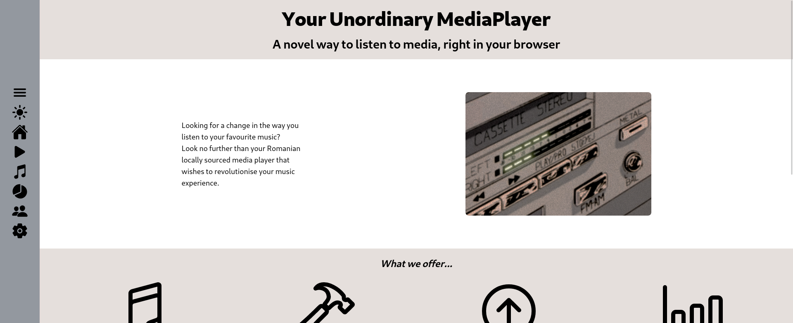
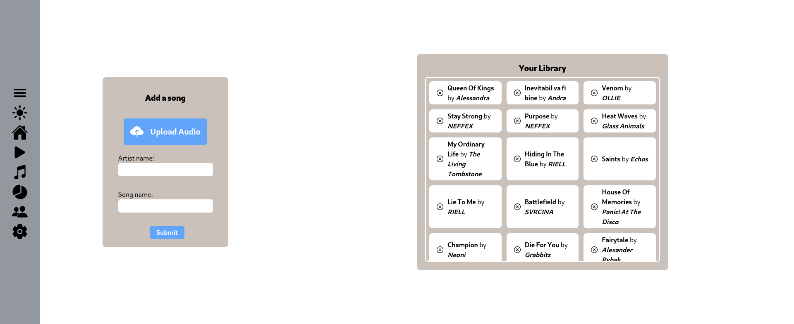
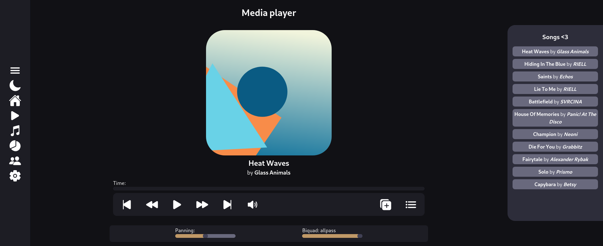
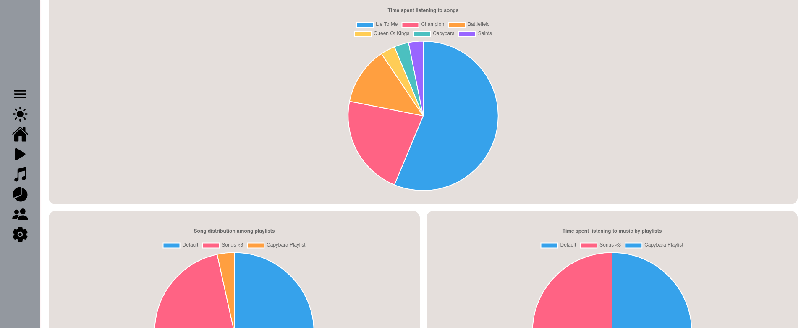

# Your Unordinary Mediaplayer

## General Information
* Category: Web
* Judetul: București
* Sources: https://github.com/RagnarokMew/Your-Unordinary-Mediaplayer
* Homepage: [site]

## Description
Your Unordinary Mediaplayer was birthed by the idea of having a better music player for already existing files on your system, as the ones provided by the operating system were not enough. As such, YUM sets out to bring the features of a mediaplayer expected by the user to the files stored locally.
 
YUM was built with a few tenets in mind, such as theme customisability, ease of use and last but not least the ability to monitor your listening habits, in a fun way with charts and piecharts.
 
YUM is split into multiple pages each with different functionalities, these being:
* The Home page (Landing Page), which is a general marketing presentation of YUM
* The Play page, where users can play uploaded songs and manage them via playlists
* The Upload page, where users can upload songs and manage their already uploaded songs via an intuitive UI
* The Statistics page, where users can see their monitor their listening habits such as: playtime, playcount, song distribution across playlists and more
* The Forum page, where users can find the answers to frequently asked questions
* The settings page, where users can customise YUM according to their own wants

## Technical Explanation

### Languages used:
* HTML
* CSS
* Javascript / Typescript

### Technologies used:
* SvelteKit
* Vite
* TailwindCSS
* Node.js
* Dicebear
* Chart.JS
* ionicons

### Storage
* IndexedDB
* localStorage

### Hosting
The site (site) is hosted via Render using the free tier.

## System Requirements:
### For accessing in on the browser:
* Internet Connection
* Any Browser (except IE 6-8, Android Browser 2.1-2.3)

### For hosting it yourself:
* Node.js 16.14 OR Node.js >=18
* Any Browser (except IE 6-8, Android Browser 2.1-2.3)

## Creators:

### Simion Ștefan (RagnarokMew)
* Scoala: Colegiul National "Elena Cuza"
* Clasa: 11
* Judet: București
* Oras: București

### Mercea Robert-Andrei (Ropler6)
* Scoala: Colegiul National "Elena Cuza"
* Clasa: 11
* Judet: București
* Oras: București

## Screenshots

