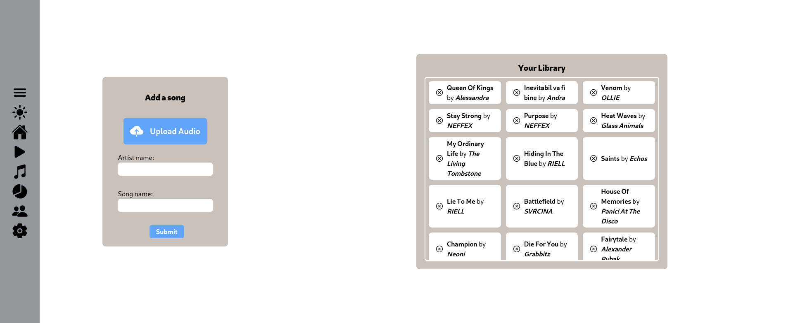

# Your Unordinary Mediaplayer

## Informatii Generale
* Categorie: Web
* Judetul: București
* Surse: https://github.com/RagnarokMew/Your-Unordinary-Mediaplayer
* Homepage: https://your-unordinary-mediaplayer.onrender.com

## Descriere
Your Unordinary Mediaplayer a luat naștere din ideea de a avea un player de muzica mai bun pentru fișierele deja existente pe sistem, deoarece solutiile oferite de sistemul de operare nu sunt suficiente. Ca atare, YUM își propune să aducă functiile unui mediaplayer modern fișierelor stocate local.
 
YUM a fost construit cu câteva principii în minte, cum ar fi posibilitatea de personalizare a temei aplicatiei, ușurința de utilizare și, nu în ultimul rând, abilitatea de a monitoriza propriile obiceiuri de ascultare, într-un mod distractiv, cu ajutorul graficelor și al diagramelor.
 
YUM este împărțit în mai multe pagini, fiecare cu funcționalități diferite, acestea fiind:
* Pagina Principală (Landing Page), care este o prezentare generală de marketing a YUM.
* Pagina de Play, unde utilizatorii pot reda melodiile încărcate și le pot gestiona prin intermediul playlisturilor
* Pagina de Încărcare, unde utilizatorii pot încărca melodii și își pot gestiona melodiile deja încărcate prin intermediul unei interfețe intuitive
* Pagina de Statistici, unde utilizatorii își pot monitoriza obiceiurile de ascultare, cum ar fi: timpul de redare, numărul de redări, distribuția melodiilor în playlisturi și multe altele.
* Pagina Forum, unde utilizatorii pot găsi răspunsuri la întrebări puse frecvent.
* Pagina de Setări, unde utilizatorii pot personaliza YUM în funcție de propriile dorințe

## Explicatii Tehnice

### Limbaje used:
* HTML
* CSS
* Javascript / Typescript

### Tehnologii utilizate:
* SvelteKit
* Vite
* TailwindCSS
* Node.js
* Dicebear
* Chart.JS
* ionicons

### Stocare
* IndexedDB
* localStorage

### Hosting
Site-ul (https://your-unordinary-mediaplayer.onrender.com) este hosted prin intermediul Render folosind nivelul gratuit.

## Cerinte Sistem:
### Pentru accesare in browser:
* Conexiune la internet
* Orice browser (cu excepția IE 6-8, Android Browser 2.1-2.3)

### Pentru a face hosting:
* Node.js 16.14 SAU Node.js >=18
* Orice browser (cu excepția IE 6-8, Android Browser 2.1-2.3)

## Realizatori:

### Simion Ștefan (RagnarokMew)
* Scoala: Colegiul National "Elena Cuza"
* Clasa: 11
* Judet: București
* Oras: București

### Mercea Robert-Andrei (Ropler6)
* Scoala: Colegiul National "Elena Cuza"
* Clasa: 11
* Judet: București
* Oras: București

## Screenshots

